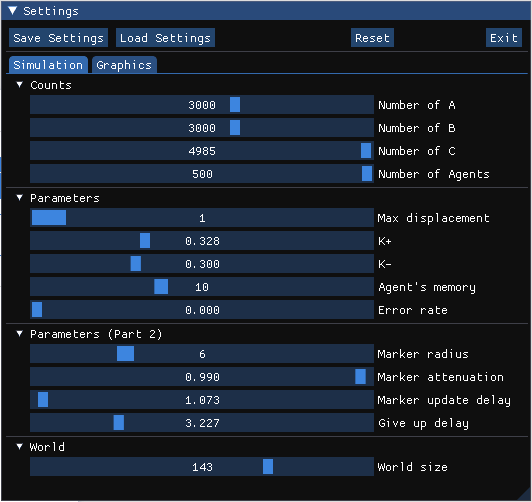

# TP2 - Multi-Agents Systems

> Collective sorting simulation

<p align="center">
  
</p>

---

## Table of Contents

- [Description](#description)
- [Screenshots](#screenshots)
- [Resources](#resources)
- [Libraries](#libraries)
- [License](#license)

---

## Description
This Simulation implements a Collective Sorting Algorithm mimicking an ant colony.
 - Each entity can perceive his local surroundings
 - 3 types of objects can exist on the world
   - 2 regular objects that need to be sorted apart from each other
   - a 3rd type that need 2 entity to work together to be moved
 - On each update, an entity has 5 possible actions
   - Move to a random direction
   - Pick up an object on the ground
   - Put an object on the ground
   - Ask for help if it carries an Object of the 3rd type (simulated by putting markers on the ground that can spread around the entity)
   - Enslave itself to a neighboring entity in order to help it move an object of the 3rd type
   - Or give up on trying to move an object of the 3rd type
 - Actions that concerns objects have a probability of occurrence calculated using fixed parameters

## Controls and GUIs
The main window features a 3D scene showing the simulation.
- Hold Right-Click and move the mouse to rotate the camera
- ZQSD are used to move the camera on the XZ plane
- Space/Shift are used to move up and down on the Y axis

A 2D Map is also available in a separate window that show 3 2D representation of the simulation
- A Map of all objects currently on the ground
- A Map of all agent colored according to their carried object
- A Map of the markers on the ground

A Settings window enable the modification of the simulation at runtime (profiles can be saved and loaded at any time)
- Change the amount of objects and entities
- Change the parameters of the simulation (memory size, max displacement, markers behaviour ...)
- Change the world size (the map is squared)
- Change the color used for each type of object
- Change the camera sensitivity
- Change the update rate and FPS
- Enabled/Disable VSync
- Show/Hide markers on the 3D view

## How to Use
### Launch
To launch the Simulation set the Main Class to ```Main.java```

---

## Screenshots
<p align="center">
  
</p>
<p align="center">
  
</p>
<p align="center">
  
</p>
<p align="center">
  
</p>

---

## Resources
- **[LWJGL Docs](https://www.lwjgl.org/)**
---

## Libraries
- **[LWJGL 3](https://www.lwjgl.org/)** : OpenGL Wrapper for Java (and other useful utilities)
- **[ImGui-Java](https://github.com/SpaiR/imgui-java)** : **[Dear ImGui](https://github.com/ocornut/imgui)** wrapper for Java
---

## License
- **[Alban098](https://github.com/Alban098)**
- **[LouisMeMyself](https://github.com/LouisMeMyself)**

This project is licensed under the **[MIT license](http://opensource.org/licenses/mit-license.php)**
